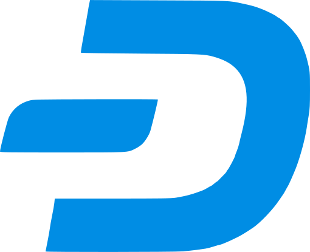

# Contribute Financially

If you like Ásbrú Connection Manager, you may also consider supporting the project financially.

## Liberapay

[Liberapay](https://liberapay.com) is a way to donate money recurrently to provide a stable crowdfunded basic income to the team, enabling them to keep doing great work that benefits everyone.

Please use the following button to proceed with Liberapay:

Even small or symbolic donation will be greatly appreciated.  You can stop at any time, including after the first donation.

## Cryptocurrencies

The Ásbrú Connection Manager project also accepts donations to the following cryptocurrency wallets:

{: width=48 style="vertical-align:middle; margin-right: 12px;" }<a href="bitcoin:19ZsvCafwRCwQSPcvfzgyiHD3Viptb4F45">19ZsvCafwRCwQSPcvfzgyiHD3Viptb4F45</a>

{: width=48 style="vertical-align:middle; margin-right: 12px;" }<a href="ethereum:0x0c3bf9C1983d2Fa192d1A78DCF9DC30596E72B98">0x0c3bf9C1983d2Fa192d1A78DCF9DC30596E72B98</a>

{: width=48 style="vertical-align:middle; margin-right: 12px;" }<a href="dash:XqrupWsSeWRJwE9KCAPiaX7YEqnf4ks5pn">XqrupWsSeWRJwE9KCAPiaX7YEqnf4ks5pn</a>
