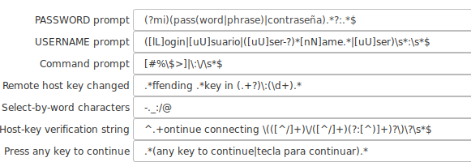
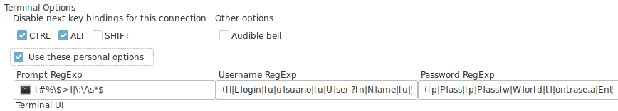
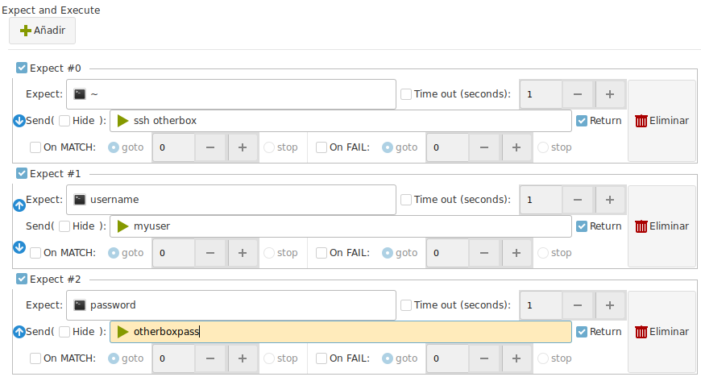
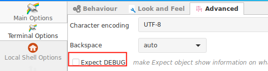

This article has been written by [Hans Peyrot](https://github.com/hanspr)

# Introduction to Expect

!!! danger "Executed during the login process only"
    Expect actions are run only during the login process.

    It helps you to automate a login sequence and a continuous set of actions.

    But they do not work after the complete login sequence ends.

    Ásbrú is not constantly monitoring your typing, so as soon as the login process ends, and the last expect is executed, there will be no more expect detection an execution.

    __You must know how to write regular expressions for this to work properly.__

There are several regular expressions in different parts of the General Preferences and Connection Preferences that allows you to control the login sequence.

## Introduction to user, password, prompt sequence.

These are the must important configuration regular expressions that will automate your login sequence.

### Global Preferences > Main Options > Advanced Settings

+ __PASSWORD prompt__: Regular expression that will detect your password prompt
    - When found will type your terminal password or passphrase for you.
    - Regex : `(?mi)(pass(word|phrase)|contraseña).*?:\s*$`
+ __USERNAME prompt__: Regular expression that will detect your username prompt
    - When found will type your terminal username for you.
    - Regex : `([lL]ogin|[uU]suario|([uU]ser-?)*[nN]ame.*|[uU]ser)\s*:\s*$`
* __Command prompt__: Regular expression that will detect your command prompt
    - When found the automated login will pass actions to your configured Expects for the terminal (if there are any configured)
    - Regex : `[#%\$>]|\:\/\s*$`
* __Remote host key changed__: Regular expression that will detect when the process detected a change in the remote host key.
    - When found, the terminal will issue the add and accept sequence and continue.
    - Regex : `.*ffending .*key in (.+?)\:(\d+).*`
* __Host-key verification string__: Regular expression that will detect you are connecting to a new server and to accept the remote key automatically.
    - Regex : `^.+ontinue connecting \(([^/]+)\/([^/]+)(?:[^)]+)?\)\?\s*$`
* __Press any key to continue__: Regular expression that will detect a press any key to continue and send a new line for you.
    - Regex : `.*(any key to continue|tecla para continuar).*`

### Terminal Options

You can override some of the previous regular expressions for a particular terminal if they do not work well on a particular connection.

Is recommended to use a terminal override when the expression you want to add is not common to all your connections or it makes your global option fail if you combine them with the more general one.

To override the global options on a certain connection activate the ___Use these personal options___ in your terminal options tab.

The meaning of this options are identical to the global options.

### Expect Tab in the terminal configuration

You may add additional expects to your login sequence with this option.

Each expect will be executed in sequence, one by one.

The first one to match will __"send"__ the configured sequence of characters to the terminal.

In the example above the sequence would be:

+ Wait for a command prompt with the symbol `~`
+ Then send to the terminal : `ssh otherbox`
+ Wait then for a string : `username`
+ Then send :`myuser`
+ Then wait for : `password`
+ Then send the string : `otherboxpass`

This could automate, login to a server, then ssh into another one from this one.

## General sequence of events

+ Connection Starts
+ Expect waits for any of the predefined sequence.
    - Wait for any of: key change, new key, password, username, prompt
+ If we do __not__ get a prompt command or have a timeout during the login process
    - DISCONNECT
+ If we have a prompt, continue
+ Execute user defined EXPECT until timeout, o no more expects detected.

## Some usual problems.

### When a key fingerprint has changed, the terminal can not connect.

Users that have been using the same configuration file since the original project PAC Manger. Could have out dated regex for the login process.

The issue manifests as :

1. SSH to new host
2. Wait for the warning with the prompt
   `Are you sure you want to continue connecting (yes/no/[fingerprint])? yes/no`
   `Please type 'yes', 'no' or the fingerprint: `
3. __DISCONNECTED__

Check your configuration regex against the ones published here. Copy paste the ones that look different to update.

[See issue #145](https://github.com/asbru-cm/asbru-cm/issues/145)

### Prompt not detected

In this case you will receive a __DISCONNECTION__ after a successful login sequence.

[See issue #473](https://github.com/asbru-cm/asbru-cm/issues/473#issuecomment-601076625)

In this case the admin at the host decided that the prompt should have this non standard format: `[hostname:userid:/home/userid:]`

So the __prompt regex__ for that particular connection had to be changed to : `:\]\s+$`

!!! tip "Debug your expects"
    If your expects do not work as expected, then you must debug your regular expressions to understand why did not work.

    In this case activate the option __Expect debug__ in your __Global Settings > Terminal Options > Advanced__

    

    When doing this all your commands and the communication will be printed on the terminal. Passwords and other sensitive data will be revealed.
