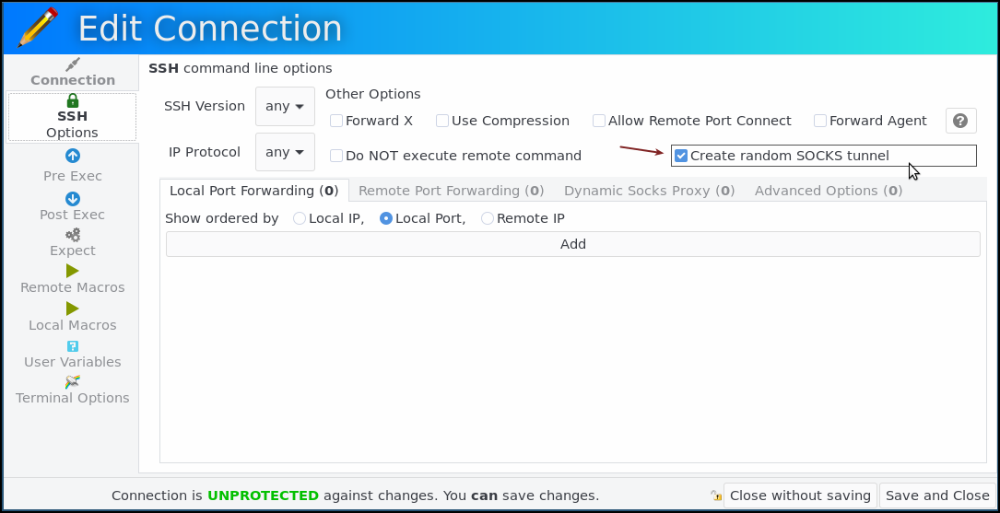

This article has been written by [Gaëtan Frenoy](https://github.com/gfrenoy), inspired by [Alberto Rinaudo](https://github.com/syco).

# Start incognito browser and use SOCKS tunnel

## Create a random SOCKS tunnel

As of version 7.4.0, Ásbrú Connection Manager supports a new option `Create random SOCKS tunnel` that will automatically create a local dynamic port fortward so your local machine will act as a SOCKS server.



When checking this option, at application startup, the option `-D:<SOCKS5_PORT>` will be added to the command line.  The value of SOCKS5_PORT is chosen randomly and will be available as variable in Ásbrú.

## Why do I need a SOCKS tunnel ?

There are various scenarios but a typical case is illustrated below:


Your machine is behind a firewall and cannot directly access a target web server.  By tunnelling the request through a local SOCKS server to a remote SSH server that we will emit the same request to the final target web server, your browser is behaving like it has a direct access to that target web server.

## How do I configure this in Ásbrú ?

You can manually configure this in Ásbrú Connection Manager in `SSH Options` > `Dynamic Socks Proxy`:


When the connection is started, a new SOCKS server will listen on port 7328 of your local address (127.0.0.1) and wait for incoming traffic to be forwarded to the remote host.

As an example, in your browser configuration, you can now setup the network connection to use that SOCKS server:


This is working fine but if you need to use a different remote servers for different types of connections, you will need to configure and remember a different port for each of them.  And if you have many servers, you can also easily make a mistake a pick twice the same ports.  Moreover, the proxy settings of your browser needs to be changed for each connection and if you want to have several connections at the same time, you'll need to run several browsers with different profiles.

It quickly becomes very cumbersome to maintain.

This is where the new `Random SOCKS tunnel` can help !

## Use a random port and local command

As explained above, you can now let Ásbrú creates that SOCKS tunnel for you and pick a random port number that is not yet used on your local computer.

Moreover, you can create a local command that will launch a dedicated browser that is automatically creating a new incognito profile and the random port configured for that connection.

Here is an example:

```
bash -c 'TMP_HOME="$(mktemp -d)"; HOME="${TMP_HOME}" /usr/bin/chromium-browser --incognito --proxy-server="socks5://localhost:<SOCKS5_PORT>" --proxy-bypass-list="<-loopback>"; rm -Rf "${TMP_HOME}"'
```

You can add this as a local command in your connection or global settings:


## Let the magic happen

With a right click on your terminal, you now have an option to start a browser, in incognito mode, that will use the SOCKS tunnel created on a random port ... All of this in one click :)


