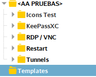
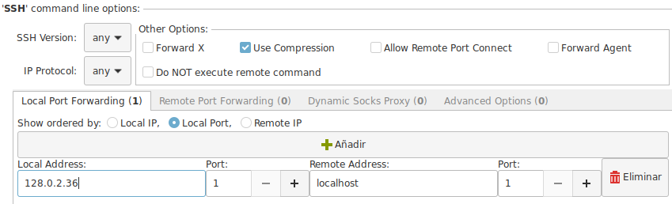
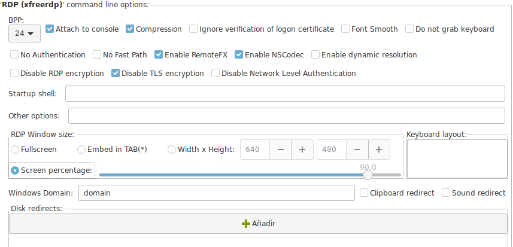
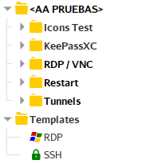

# Templates

This article has been written by [Hans Peyrot](https://github.com/hanspr)

A recurring question of users is if there is a possibility to have "Templates" for connections so you do not have to reconfigure everything.

Thou the concept of Templates do not exist, it can be implemented very easy by you.

__There are 2 approaches to this problem__

1. All your existing connections are templates
1. Create a Templates group and add templates of all common connection types that you use.

## Existing Connections are Templates

+ Click on any existing connection that has the most similar configuration that you need.
+ `<Ctrl-D>` or right click `Clone`.
+ Edit the new cloned connection and adjust to your new conditions.
+ If the connection has to be available in a different group.
  - `<Ctrl-X>` Cut the connection node.
  - Click on group where you want the new node to be.
  - `<Ctrl-V>` paste the node in the new location.

## Creating Templates Group

Go to your Connection List and Create a new group called "Templates".

1. Create a new connection of the type you need your template.
1. Named so it gives you an idea of the options that has
    2. SSH and Xforward.
    2. SSH and Local Forward.
1. Fill with generic data.
1. Set the predefined options that you like to have on all new connections.

To use your new templates.

+ Click on the template configuration that you need.
+ `<Ctrl-C>` or right click `Copy`.
+ Click on group where you want the new node to be.
+ `<Ctrl-V>` paste the node in the new location.
+ Edit your new node with the real connection data.
