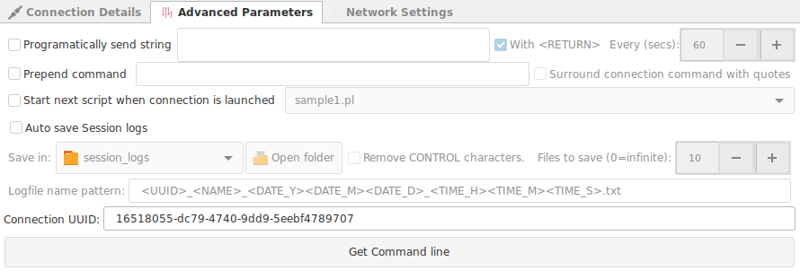
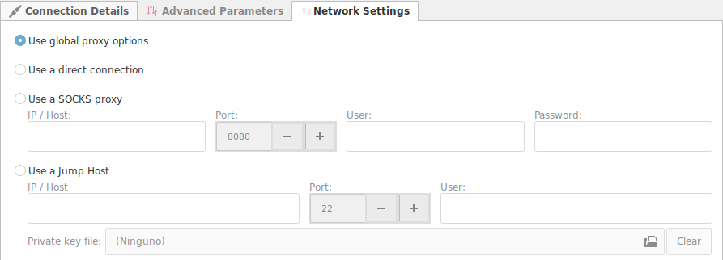

## Connection

### Connection Details

+ __Method__ : For this case, we select
    - freerdp
    - rdesktop
+ __Host__ : The IP or Hostname of the machine we want to connect to.
+ __Port__ : Port number to use for this connection.
+ __Run with sudo__ : * Pending
+ __Use autossh__ : * Pending
+ __TAB/Window Title__ : The name will be assigned to this tab or window. (Useful for password managers, that use the window title to execute macros, or to identify each connection on the taskbar).
+ __Launch on start up__ : If this connection should be launched automatically each time Ásbrú starts for the first time.
+ __Reconnecton on disconnection__ : If there is a remote disconnection, reconnect automatically.

+ __Authentication__
    - __KeePass button__ : If you have KeePass integration available, the button will be enabled. To see the use of this feature read [KeePass Integration](../Preferences/KeePassXC.md)

    - __User / Password__ : Authenticate using the traditional logging sequence of typing a user and password.
    - __Private Key__ : Use a public or private key to login into the remote server.
        - Private Key : Select your private key, or leave black if you are going to use your public key.
        - User / Passphrase : The user and passphrase that will be used to automate your login.
    - __Manual__ : Do not automate login, let me do all the authentication sequence.

### Advanced Parameters

+ __Programmatically send a string__ : Send a specified regex expression every selected seconds to the terminal.
+ __Prepend command__ : Add this command before the ssh command connection string.
+ __Start next script when connection is launched__ : * Pending
+ __Auto save session logs__ : Save session log at the end of the session. Select the location.
    - Log patter name: Define the pattern to name your session file.

### Network Settings

This networking options override the Global Networking options for this connection.

+ __Use global proxy options__ : Use the globally predefined Networking options.
+ __Use direct connection__ : If you declared a Global Proxy and you do not need it for this connection.
+ __Use SOCKS proxy__ : Use a SOCKS proxy to exit the local network.
+ __Jump Server__ : Use a jump server to exit the local network, or connect to an internal machine behind a FireWall.

## RDP Settings

