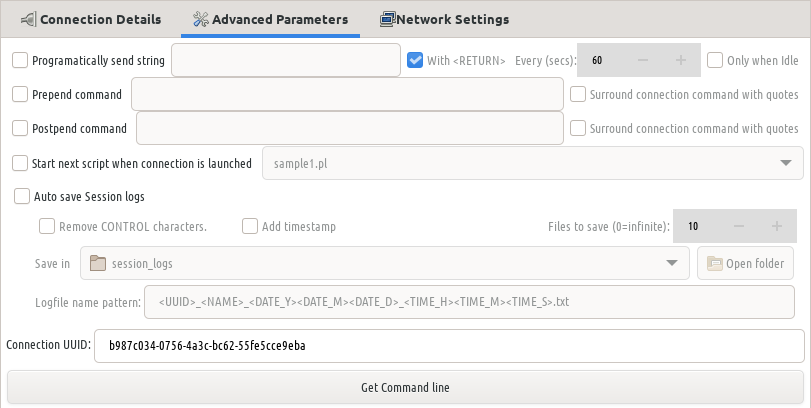
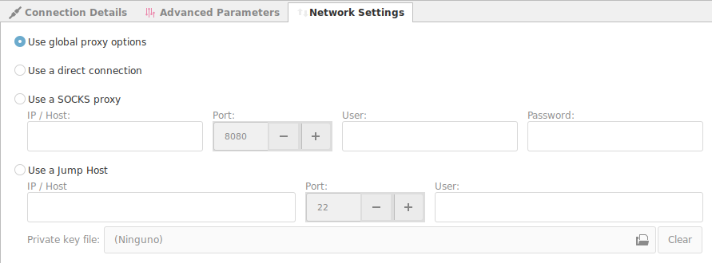
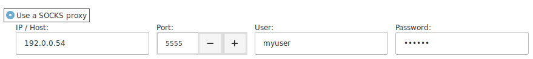
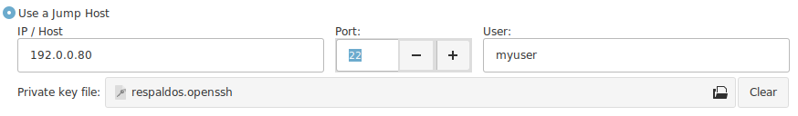
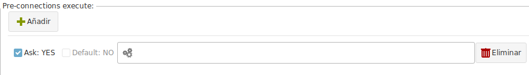
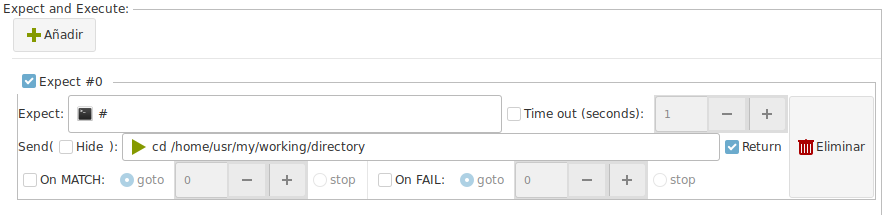
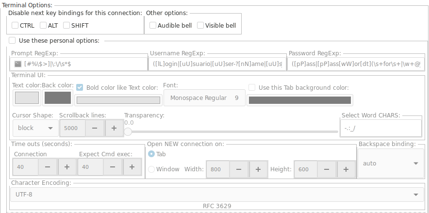

## Connection

### Connection Details

+ __Method__ : For this case, we select SSH
+ __Host__ : The IP or Hostname of the machine we want to connect to.
+ __Port__ : Port number to use for this connection.
+ __Run with sudo__ : * Pending
+ __Use autossh__ : * Pending
+ __TAB/Window Title__ : The name will be assigned to this tab or window. (Useful for password managers, that use the window title to execute macros, or to identify each connection on the taskbar).
+ __Launch on start up__ : If this connection should be launched automatically each time Ásbrú starts for the first time.
+ __Reconnecton on disconnection__ : If there is a remote disconnection, reconnect automatically.

+ __Authentication__
    - __KeePass button__ : If you have KeePass integration available, the button will be enabled. To see the use of this feature read [KeePass Integration](../Preferences/KeePassXC.md)

    - __User / Password__ : Authenticate using the traditional logging sequence of typing a user and password.
    - __Private Key__ : Use a public or private key to login into the remote server.
        - Private Key : Select your private key, or leave black if you are going to use your public key.
        - User / Passphrase : The user and passphrase that will be used to automate your login.
    - __Manual__ : Do not automate login, let me do all the authentication sequence.

!!! danger "Important information about passwords"
    The password / passphrase fields can have 3 possible values.

    + Password field
        - Empty : During the login process you will be requested to type your password
        - Value : The value saved in the field will be used as the password to automate your login.
    + Passphrase field
        - Empty : During the login process the passphrase will not be asked. It asumes your have configured a passwordless key.
        - Value = `<<ASK_PASSS>>`: If you type this keyword, the Ásbrú will prompt for the passphrase when it detects that has been requested by the login process. This is useful if you do not want to store the passphrase in its configuration file.
        - Value : Any other value will be stored in Ásbrú's configuration file. And it will be used to automate the login process.
            - The value can be the password, or a KeePass mask (see below).

    If you are aiming for the highest level of security and automation at the same time, you need to use [KeePass Integration](../Preferences/KeePassXC.md)

### Advanced Parameters

+ __Programmatically send a string__ : Send a specified regex expression every selected seconds to the terminal.
+ __Prepend command__ : Add this command before the ssh command connection string.
+ __Start next script when connection is launched__ : * Pending
+ __Auto save session logs__ : Save session log at the end of the session. Select the location.
    - Log patter name: Define the pattern to name your session file.

### Network Settings

This networking options override the Global Networking options for this connection.

+ __Use global proxy options__ : Use the globally predefined Networking options.
+ __Use direct connection__ : If you declared a Global Proxy and you do not need it for this connection.
+ __Use SOCKS proxy__ : Use a SOCKS proxy to exit the local network.
+ __Jump Server__ : Use a jump server to exit the local network, or connect to an internal machine behind a FireWall.

If your network administrator has added a SOCKS server to the network and grants you access to it, you will have to select and configure the SOCKS Proxy.

If you have SSH access to a remote machine in your network, that has access to the a local machine on the remote network. Then you can use this technique to access to an external machine behind a firewall, that has no public address.

You need to have a public key installed in your __Jump Server__  to be able to use it as an intermediate machine to access the other network.

It can be a default public key, or a personal private key that you were assigned.

## SSH Options

Select any additional SSH options.

### Local / Remote Port Forwarding

Define your local or remote port forwarding rules.

In the example image above, the connection opens 4 port forwards to access remote SQL Servers behind a Firewall.

### Dynamic Socks Proxy

*Pending

### Advanced Options

Write any sequence of additional SSH options.

The command field allows you to right click and have access to known SSH options.

## (Pre / Post) Exec

This commands will be executed immediately before (Pre) the connection is launched. And after (Post) the connection has been established.

This commands are executed in the local computer.

!!! tip "Possible uses"
    Launch : an IDE, a Database Client (DBeaver), start a local scripts that uploads or downloads files, etc.

## Expect

You can create and execute a sequence of automated actions that will be executed during your login process.

+ __Expect__ : Regular expression that defines what patter to wait from the terminal.
    - __Timeout__ : How long to wait for the pattern and abort if it does not presents.
+ __Send__ : When the pattern has a match, send the next sequence of characters.
    - __Return__ : Add a CR at the end of the string.
    - __Hide__ : If the content of this box should be treated as a password field. Hide visual information for peering eyes.
+ __On MATCH / Fail__ : Execute the next Expect #number in case of MATCH or Fail.
+ __Delete__ : Remove the selected rule.

!!! danger "Executed during the login process only"
    This expect actions take place only during the login process.

    It helps you to automate a login sequence and a continuous set of actions.

    But they do not work after the complete login sequence ends.

    Ásbrú is not constantly monitoring your typing, so as soon as the login process ends, and the last expect is executed, there will be no more expect detection an execution.

!!! tip "More detailed information"
    For a more detailed information on Expect read : [Introduction to Expect](../../Managing/Expect.md)

## Remote Macros

Remote Macros have the same principle as the [Global Remote Commands](../Preferences/RemoteCommands.md)

!!! note " "
    But this commands will show on the popup menu for this connection only, and no others.

## Local Macros

Local Macros have the same principle as the [Global Local Commands](../Preferences/LocalCommands.md)

!!! note " "
    But this commands will show on the popup menu for this connection only, and no others.

## User Variables

This have the same principle as the [Global Variables](../Preferences/GlobalVariables.md)

But will be available only for this particular connection.

## Terminal Options

You can override the Global Terminal Options and Look&Feel of any particular connection.

Enable "Use these personal options"

!!! tip "Stand out a terminal"
    Perhaps you want to add a dark red color to a terminal to note that you are connected to a production server and not to a testing server.
