# The SSH Terminal

### Connection Details

__Method__ : For this case we select __SSH__

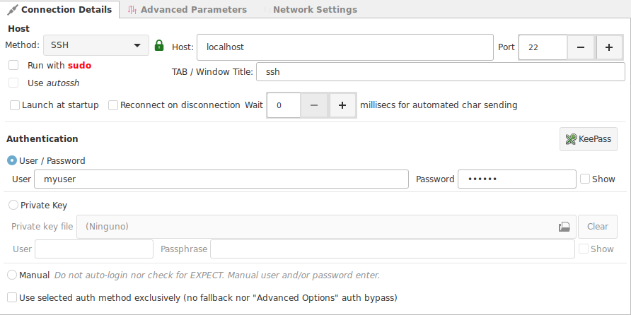

## SSH Options Tab

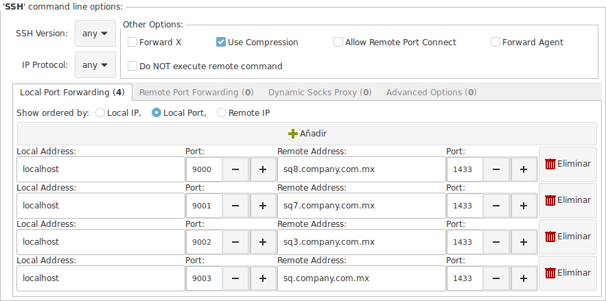

Select any additional SSH options.

### Local / Remote Port Forwarding

Define your local or remote port forwarding rules.

In the example image above, the connection opens 4 port forwards to access remote SQL Servers behind a Firewall.

### Dynamic Socks Proxy

*Pending

### Advanced Options

Write any sequence of additional SSH options.

The command field allows you to right click and have access to known SSH options.

## The login process

If you have configured your connection to have full automation, the login sequence will not require any intervention on your part, and the login process will look as clean as this.

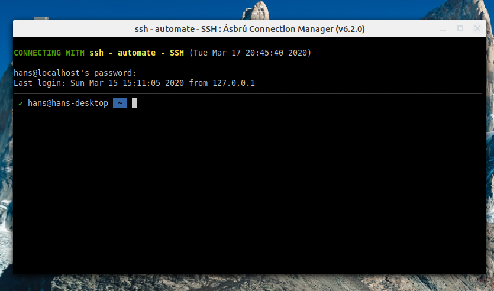

If you have configured your connection not to have a saved password, you will receive a popup window requesting you to type your password.

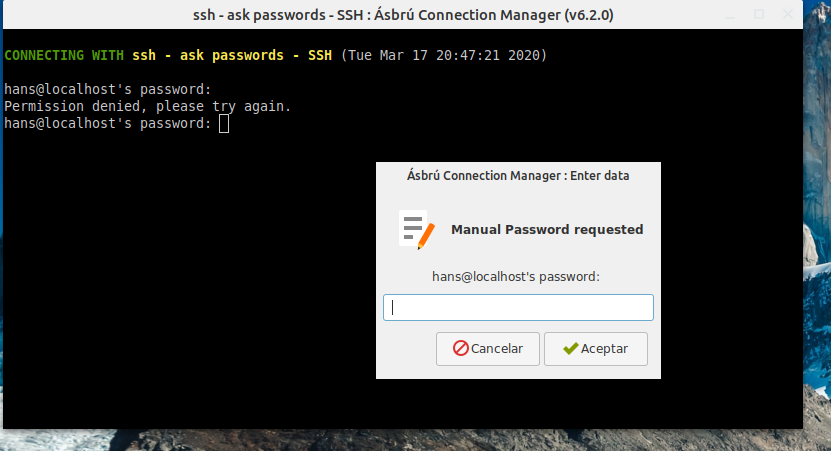

!!! note "Expired passwords and change password required"
    In this cases you may see additional popup windows for each password requested: password, original password, new password, confirmation password.

    If you have problems to complete an expired password process, because the expect regex do not work well for you.

    + Edit the connection and set it to __Manual__
    + Save
    + Open the connection and complete the login sequence manually

## Mouse Interaction

Ásbrú uses the gnome vte library, and is a mouse driven terminal.

### Copy / Paste

We will begin explaining the concept of copy paste in the terminal, because is the one that confuses many users.

When you are connected to a remote server, the remote application could request and process mouse events or not.

If the remote application does not process any mouse events, then the local terminal processes this mouse events locally.

To distinguish if the remote application is processing mouse events, look at the mouse pointer shape. When a remote program is not processing mouse events then the mouse pointer is a text caret.

__No mouse processing__

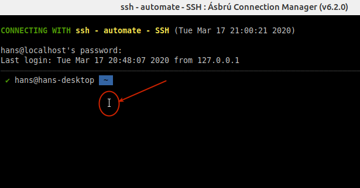

__Mouse processing__

The mouse pointer looks as your default pointer.

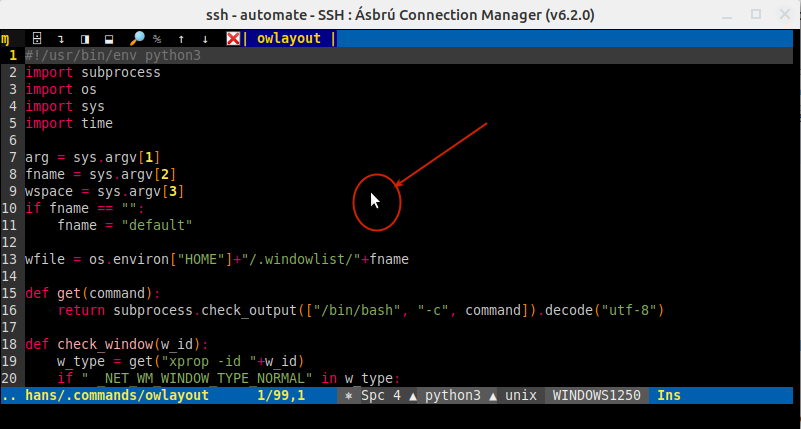

!!! tip "Local Clipboard"
    A local selection creates copies to your __local clipboard__, not to the remote clipboard.

    This will let you paste the text in some local application (text editor, IDE, etc.)

#### Remote application does NOT process mouse events.

__double click__ : The terminal will select a "word" on the "visible" text of the terminal. The characters used as a word are [a-Z_] plus any additional characters that you configured in rule described in the [Main options Advanced Tab : Select by word characters](../Preferences/MOAdvanced.md).

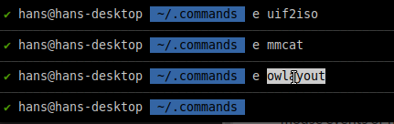

__triple click__ : The terminal will select the "visible" row of text of the terminal.

__Click and drag__ : The terminal will select the text from the start point of the mouse drag to the end point in a complete sequence, jumping lines and start from the beginning of the next new line.

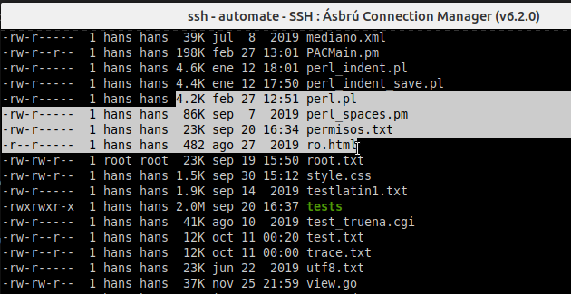

__`<Shift + Ctrl>` + drag__ : Will create a square selection from the starting drag point to the end.

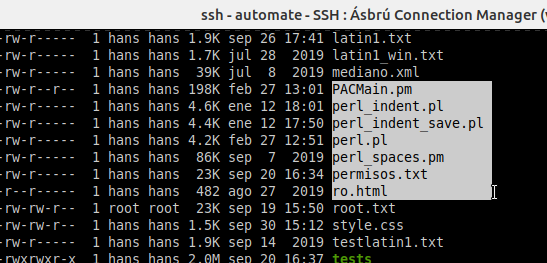

!!! tip "Copy / Paste"
    As soon as you select the text and release the mouse, the selected text is copied to the clipboard without any further actions (no need to : `right-click > Copy`, `<crtl-c>`)

    + To paste your text into another application `<Ctrl-V>`
    + To paste text from your local clipboard into the terminal. `<Shift + Insert>` or `right clic > Paste`.
        - You can imagine that the "Paste action", is similar to sending all the characters in the buffer to the terminal. So they will be sent with all the existing tabs, new line characters, etc.

!!! danger "The terminal is a canvas"
    The terminal has no knowledge of the remote application, so when selecting and copying, it selects the text that finds on the visible area, and treats it as a canvas (a paintable area).

    Do not expect the terminal to know that there are : line numbers or drawing characters to ignore, it will copy all the text under the selection.

#### Remote application does process mouse events.

Depending on the remote application and connection speed, the selection process would look and feel different :

+ could be very slow
+ or the selection is shown after releasing the mouse
+ or the highlight is delayed.

__Example of a remote double and triple click selection__

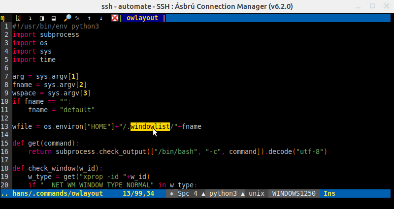

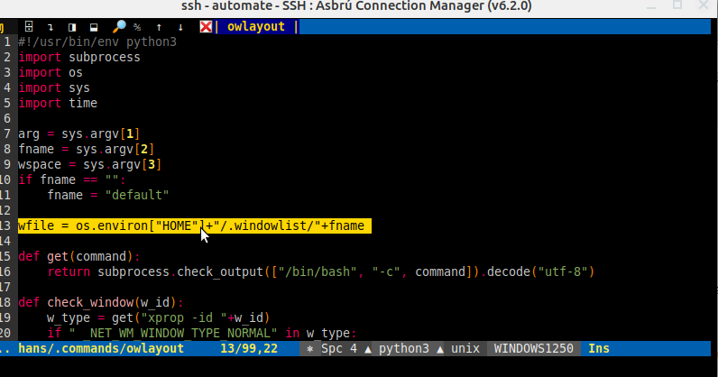

!!! tip "Selected text"
    When the selection and copy actions take place, they are located in the remote application clipboard, not on your local clipboard.

    To be able to use the terminal actions described above. You will have to use the `Shift` key during your mouse operations to instruct the terminal "not to pass the mouse event to the remote program".

### Common problems of copy paste text from terminal to local application

__Copy / Paste from editor copies line numbers__

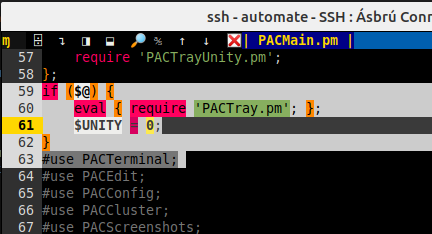

__Solution__

Use the square selection technique, or hide the number panel in your editor before copying.

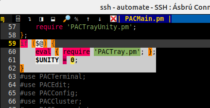

## Poppup Menu

When you right click on the terminal or `<Shift> + right click` (if the remote application process mouse events)

You will see a popup menu similar to the next image.

__Actions__

* Pending

