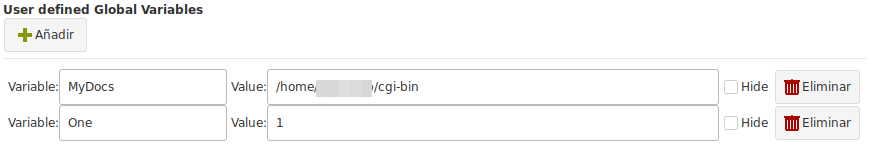

# Global Variables

Global variables, allows you to define variable names and assign them a value.

That variable can be latter used in any:

+ Local Commands
+ Global Commands
+ Expect definitions

To add a new entry click on the "Add" Button.

## Fields

+ __Variable__ : The name you want to assign to you variable.
+ __Value__ : The value of your variable. It can be any text.
+ __Hide__ : If this entry should be masked with the password character so its not visible displayed when editing this section.
+ __Delete__ button : Remove the selected variable from the list.

To use a variable use the pattern : <GV:variable_name>

For example, using the above image, you could create a command similar to this one:

`ls -l <GV:MyDocs>`

And assign it to a local, remote command or expect.

