## KeePass Integration

!!! danger "Important"
    This documentation corresponds to Ásbrú 6.2+

    __This new integration breaks compatibility with stored users and passwords of previous Ásbrú versions__.
    Which means you will have to reconfigure the usernames and passwords fields. Or run a helper migration application if available.

    The current integration uses `keepassxc-cli` to access the database, [https://keepassxc.org/](https://keepassxc.org/).

    To see the reasons for this hard changes, please read at the end of this documentation page.

## KeePass Organization

It is very important to prepare your KeePass database to work with this integration. The database access is done using the command line tool `keepassxc-cli`

And by design this tool imposes certain restrictions.

* All paths must be unique to be able to retrieve the correct user name and password at the time of the connection
* The cli will not allow to search by `uuid`, so the only search pattern that guaranties unique entries is the full path to the key

This means that you must organize your data in groups and subgroups to guaranty unique paths at the time of configuration.

To explain this better, lets look at the following images.

__You have this password organization__

In keepass, you can visually tell what is the entry you are interested in, by looking at the relationship of Group:Title:Username

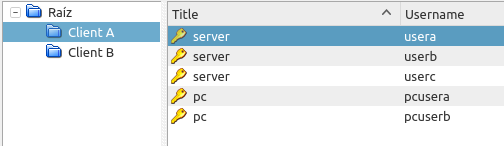

But when using the CLI, we only have access to Group:Title, and a listing of entries would look like this.

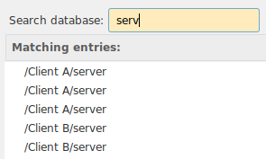

This brings 2 problems

* We do not know which entry we want.
* Later when Ásbrú wants to pull the user name and password during a connection, keepassxc-cli will pull the first entry found, it will not return all the entries. So the CLI will not know which entry we want either.

__So, you must make sure all your entries are unique : Group:Subgroup:..:Title__

You can use any technique you like, this are some recommendations of organizations that can produce unique paths.

* /Group/hostname
* /Group/Subgroup/hostname
* /Group/Service/hostname
* /Group/Location/hostname

__Example of unique titles__

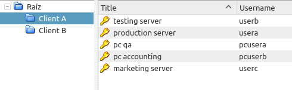

__Search result.__

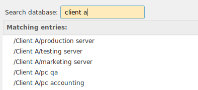

__Another alternative, with subgroups__

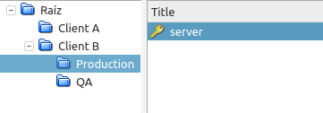

__List__

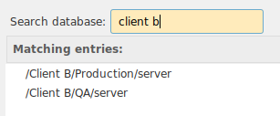

## Configure

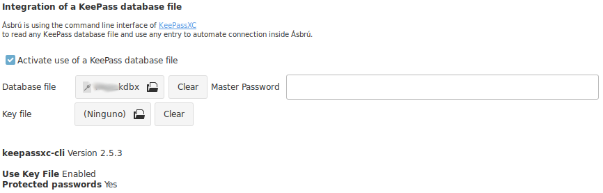

+ __Activate use of KeePass database file__ : Activate KeePass functionality.
+ __Database file__ : Select the location of your database.
+ __Master Password__ : This field is optional.
    - If provided, the password will be stored in the `asbry.yml` file for convenience so you do not need to type it.
    - If left blank. Ásbrú will ask for the password the first time is needed, and then retain in memory for the remaining of the Ásbrú session.
+ __Key file__ : If your version of keypassxc-cli supports it, and you have configured your database to use a keyfile, then selected here.
+ __keepassxc-cli binary__ : you can choose a different `keepassxc-cli` binary to use. In case you have installed for your user only or want to use a different version available in your system.
    - On every change the application will validate the existence and capabilities of the selected version.
+ __Clear buttons__ : Remove any previously selected file.
+ __Info__ : Ásbrú, will show the current keepassxc-cli version and the capabilities detected in your current version.
    - If no keepassxc-cli detected, install keepassxc package to have it available.
    - If some capabilities are not present, it means you may have to upgrade your keepassxc version.

## How to use

### Enter Master Password

If you decided not to save the Master Password, when access to the database is needed you will see a prompt similar to this one.

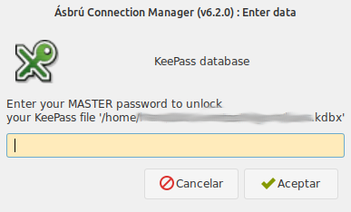

Type your password and clic on "Accept". If the application can not unlock the database will prompt again.

You can type cancel if you do not want to unlock the database, or the password you are entering is not working.

### Assign a user name and password to a connection.

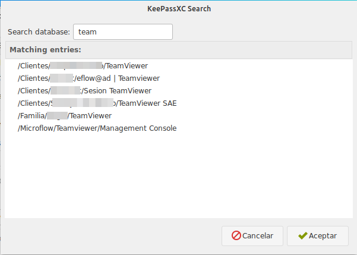

Click on the "KeyPass" icon to open the KeePassXC search, this window will allow you to search keepass entries and list the results.

Locate the entry you want to use as a reference and then double click on that entry.

After the double click the link to your username and password will be assigned to the active authentication method selected in the configuration tab.

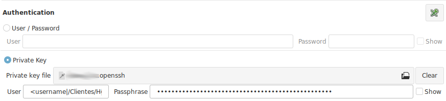

!!! tip "Recommendations"
    __KeyPass pattern__ : The pattern is formed as : `<keepass_property|keepass entry path>`. You can edit and change the text to any valid property and path if your need.

    Current properties available from keepassxc-cli : username, password, title, url, notes

    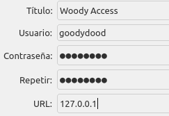

    __I selected the wrong authentication method__ before selecting my keepass link. Simply copy paste the entries to your the correct fields, or change the method and select your entry again.

## Assign URL, or other properties to other fields

Some fields gives you access to keepass list search to add an entry to : expects, variables, local commands, etc.

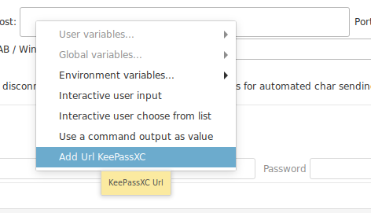

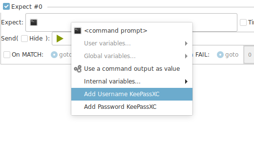

## Known restriction or limitations of the current model.

This are known limitations of the current model.

+ The cli access will not allow to have an "unlocked" state.
    - It could be accomplished by opening an interactive session.
    - But this would introduce the need to replicate most of the logic in keepassxc-browser integration (create a service). Which is quite extensive, and in this case would make no sense to replicate existing work, would be better to implement the browser integration client.
    - The `cli`, offers a very clean, easy and safe access that decouples Ásbrú from becoming a security target for command injections, etc.
+ The main impact is visible if you decide to setup a keepass database with version 4+ and add a very strong encryption. This will create a delay of up to 5 seconds to unlock the database on every connection.

!!! note "Is your decision to balance the time to unlock and level of encryption"
    If you are willing to wait the 5 seconds of unlock time for a connection then is OK, you decide.

!!! note "Why don't you implement the browser integration?"

    Perhaps in the future it could be possible. And the current implementation would be ready to do so.

    But as of this date (2020-03-12), the Ásbrú project, is still recovering from the hard migration to gkt3 and there are many features and stability issues that need to be addressed.

    This was the must balanced path to deliver a good integration and attend all other issues.

## Why did you have to rewrite and brake compatibility?

The functionality was completely rewritten to address several related requests and additional issues detected in the previous implementation.

__Current Implementation__

+ Is no longer required to save the database Master Password inside Ásbrú configuration files.
    - If password is not stored, it will ask for it when needed only once, and saved in memory for the current Ásbrú session.
+ User names and passwords are retrieved from database on the fly at the moment of connection.
    - You can change your passwords in your database and in the next connection the new one will be used.
    - No unencrypted passwords, users, database are retained in memory or files any more.
    - User name and passwords are references now.
    - KeePass Url entry, can be used as a reference to get the host to connect to.
    - User has complete control over what Ásbrú should access and not.
+ User can migrate databases versions freely without any need to wait for Ásbrú to catch up.
+ Users can use a keyfile to unlock the database.
+ Linking keepass users and password to entry paths guaranties a 1 to 1 match.
+ Decouple Ásbrú from any responsibility to access the database directly, making it more secure for the end user.

__Previous Implementation issues__

+ Would extract absolutely __all passwords even when they were not related to any connection__, pulling out any other information that a user could have stored like : bank accounts, credit card nips, etc.
    - The full information, was completely cached inside Ásbrú.
    - This also lead to the need to manually "Reload" the database when changes in keepass were made.
+ If hundreds of entries
    - The full password list was located in a long popup submenu.
    - Very difficult to follow and select.
    - Slow database reload. Ásbrú would look as it freezed.
    - Slow start ups.
+ Some entries could return more than one match and the user would be required to choose the correct one during logins.
+ The database was accessed directly with a library
    - The library had to be maintained if the database encryption algorithms changed.
    - Use of keyfile had to be implemented in the library to be able to use.

