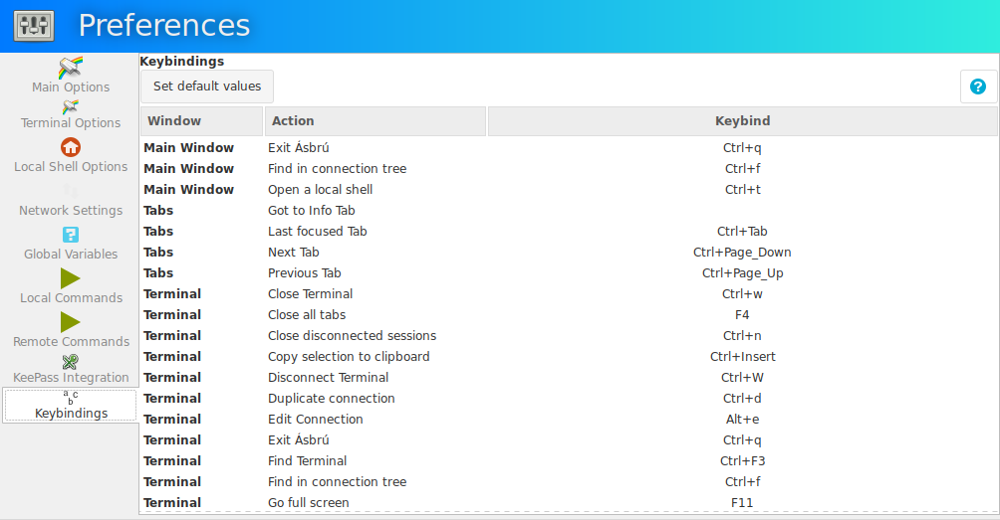
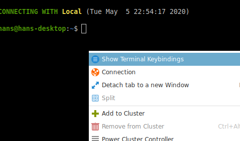
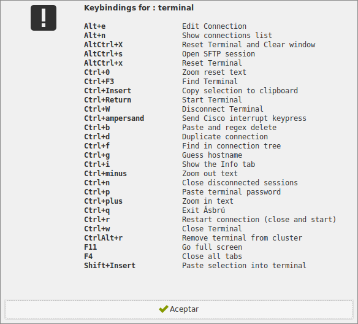
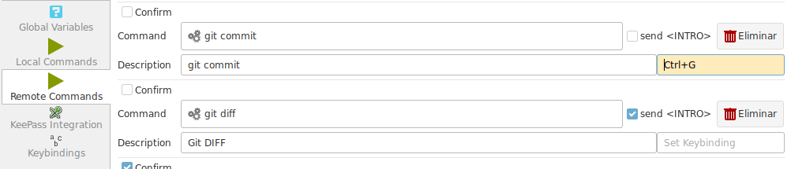

# Keybindings

Select the __Keybindings tab__ to list the available actions and current keybindings set to each one.

+ Window : where the action will take place.
+ Action : What will be executed
+ Keybind : The key combination that will trigger the corresponding action.

!!! important "Precedence"
    The key bindings should not be repeated on different actions, to avoid conflicts when multiple windows are available simultaneously. 

    For example users of the traditional mode have all windows available at the same time : Main Window, Tabs, Terminal, Connections list.

    Gtk will use the following priority at the moment to test events
    
    1. Main Window
    2. Tabs widget
    3. Terminal
   
    If a key combination is processed in a window with precedence, the action will not be available for the window with less priority.

    But key combinations in different windows is not restricted, because when working with detached window terminals there is no conflict with other windows.

 
    
## How to customize keybindings

+ Select a row
+ Type your new key combination, the Keybinding column will be updated.
    - If you select a repeated combination in the same window, the action will be aborted and you will receive an error message. Unbind the offending key first.
    + If the selected combination is repeated in a different window the application will warn but will not forbid it
+ Use the `Delete` or `Backspace` keys to remove a keybinding. This will disable that action to be triggered by any combination. Some of them will still be available from the popup menus.

## List keybindings

If you forget the available actions and what are the current keybindings associated.

Right click on the terminal or Connection List, and select "Show Keybindings"

This will show a message box with the current available keybindings.

Any action that is disabled will not be shown.

## Bind a key to Local or Remote Commands

Create your command. Select the field with the placeholder that says "Set keybinding".

Type your key combination.

