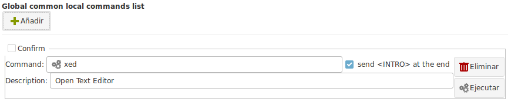
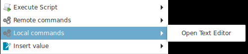
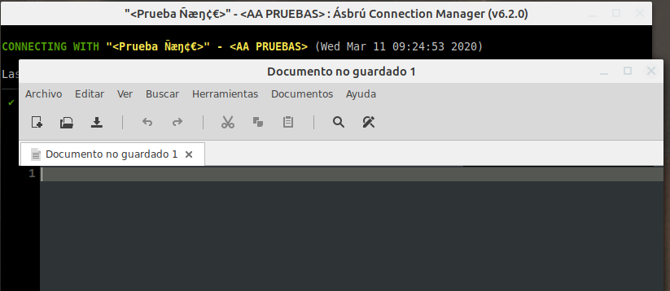

# Local Commands

Local commands are instructions that will be executed in your local computer.

They could be used to :

+ Open your favourite local text editor, web browser, etc.
+ Remove a temporary directory or file.
+ Open a location in your hard drive, etc.

## Fields

+ __Confirm__ : If Ásbrú should prompt for a confirmation before executing this command. Useful if your command takes to much time or destroys information.
+ __Command__ : The command to be executed in your computer. The command can include a global variable.
+ __Description__ : The name to show in the popup menu.
- __Set Keybinding__  : Click in the field and type a key combination to assign a hot key to your command. This hot key will be available in a terminal (version 6.3+) 

## Execution

In the image above we created a command that will open the local Text Editor `xed`.

To access this commands we must have an open terminal and right click on it.

After clicking on the remote command, the local text editor is shown.

