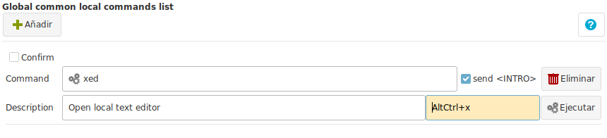

# Preferences : Local Commands

Local commands are instruction that will be executed in your local computer.

They could be used to :

+ Open your favourite local text editor, web browser, etc.
+ Remove a temporary directory or file.
+ Open a location in your hardrive, etc.

In the image above we created a command that will open the local Text Editor `xed`.

To access this commands we must have an open terminal and right click on it.

After click the local text editor is opened.

