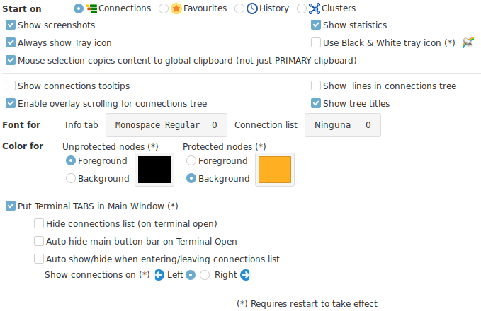
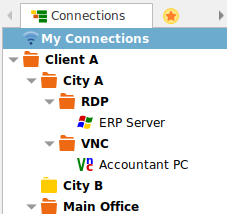
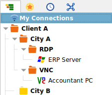
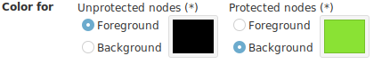
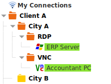
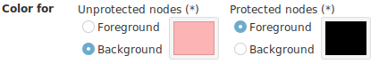
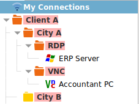

## Options

+ __Start on__ : Select the tab you would like Ásbrú to start on when launching the application.
+ __Show screenshots__ : Present the thumbnails of existing screenshots.
+ __Show Statistics__ : If the statistics section should be presented in the main application interface.
+ __Always show Tray icon__ : Show tray icon even when the main application is open or just when has been hidden.
+ __Use Black & White icon__ : Useful for dark themes.
+ __Mouse selection copies to global clipboard__ : When selecting text in a terminal, the text will be copied to the global clipboard so it will be available to other applications for paste.

+ __Show connections tooltips__ : When you hover over your connections lists, will show a tooltip with the basic information for that connection.
+ __Show lines in connections tree__ : se images below
+ __Enable overlay scrolling for connections tree__ : will hide scroll bars when mouse is inside the connection tree only
+ __Show tree titles__ : When disabled, the tab titles for the different connection lists, will be hidden to compact the tabs interface (se images below).

+ __Font for__
    - __Info TAB__ : Select the font and size you want to use in the Info Tab
    - __Connection List__ : Select the font and size to use in the Connection List
+ __Color for__
    - __Unprotected nodes__ : Select foreground or background color
    - __Protected nodes__ : Select foreground or background color

The correct selection of this colors, will allow you to configure the interface to handle dark or light themes, and decide what is it that you want to stand out: Protected nodes or Unprotected nodes.

Examples

__Protected nodes stand out by being green (Safe)__

__Unproteceted nodes stand out by being red (Danger)__

+ __Put terminals in TABS in Main Window__
    - __This settings are ignored in compact mode__
    - Hide connection list on terminal open
    - Auto hide button bar on terminal open
    - Auto Hide/Show when entering connection list
    - Show connections list on : Left or Right

!!! note "Show connection list buttons"
    When the auto hide options are set, you will be able to see the hidden list and buttons by selecting the "Info" tab.

