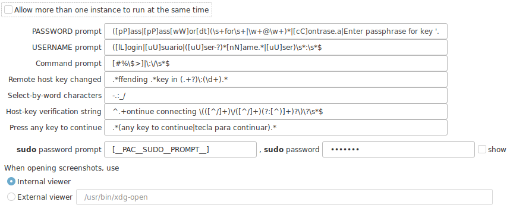

# Advanced Options



!!! note "Customize to your language"
    Some of this options might need to be customized to work with your language, or more detections might be needed for multiple languages.

+ __PASSWORD prompt__ : Regular expression to identify your terminal password prompt.
+ __USERNAME prompt__ : Regular expression to identify your terminal username prompt.
+ __Command prompt__ : Regular expression to identify your terminal prompt.
+ __Remote host key changed__ : Regular expression to identify when a message of a conflicting known host was sent by the terminal.
+ __Select by word characters__ : List of characters that identify a "word". This is used when double clicking on the terminal. The selection will expand as long as any of the listed characters appears next to the doubleclick location. __Important, this is "not" a regular expression, is a simple list of characters__
+ __Host key verification string__ : Regular expression to identify when a message of a new known host was sent by the terminal.
+ __Press any key to continue__ : Regular expression to identify when a request to continue has been sent by the terminal.
+ __sudo password prompt__ : *pending
+ __sudo password__ : *pending

+ __When opening screenshots, use__
    - The internal viewer
    - And external viewer. You must the the path and name of the application.

## Prompts (Password, Username, etc.)

The original prompt command for detecting a password request could not work for some of your servers, depending on the : language settings, customized distribution prompt changes, etc.

In this cases you may need to adjust your prompt regex.

For example, the original prompt regex for password detections is:

`([pP]ass|[pP]ass[wW]or[dt](\s+for\s+|\w+@\w+)*|[cC]ontrase.a|Enter passphrase for key '.+')\s*:\s*$`

While this prompt work very will in general for english platforms, it has some minor issues in other latin languages where the grammar changes.

In the above example, the expression expects that immediately after the "password" word detected e ":" should come up. Which is not true for spanish.

```
# Enlish prompt

(current) UNIX Password:

# Spanish prompt

(actual) Contraseña de UNIX:
```

Below is a more general regular expression (but not complete)

`(?mi)(pass(word|phrase)|contraseña).*?:\s*$`

But this expression is limited to English and Spanish. You may need to edit the Spanish word _contraseña_ or add more words in different languages to the regular expression.

For example:

`(?mi)(pass(word|phrase)|contraseña|passwort).*?:\s*$`

or

`(?mi)(pass(wor[dt]|phrase)|contraseña).*?:\s*$`

!!! tip "Recommended Password prompt"
    `(?mi)(pass(word|phrase)|contraseña).*?:\s*$`
