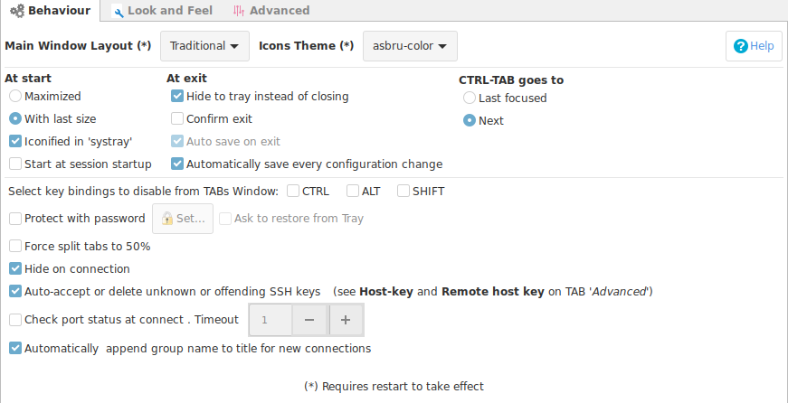

## Main Options

## Main Window Layout

Ásbrú offers two interface options to interact.

__Traditional__

This is the standard interface and is recommended for users that are "Tabs" driven users and like to have all options and interactions available in the same window.

All sessions are launched in the same interface in separate Tabs.

__Image example__

+ Recommended for users that
    - Want to have all options accesible in a single interface
    - Do not want to deal with moving, resizing and arranging windows

__Compact__

This mode is for "Windows", "Minimalist" driven users. The main window interface will be hidden in your system tray. And you will launch all sessions in separate windows, or inside a single window with tabs. You will have the minimum amount of buttons to interact with the application.

+ Recommended for users that
    - Like having multiple windows and arranged them to have simultaneous multiple views, without size restrictions and overlapping
    - Like to have the cleanest interface possible when working with your projects

__Image examples__

__Tabbed interface hidden__

__Tabbed and interface shown__

__Separate windows simultaneous views side by side__

!!! danger "Important"
    The Compact mode hides or disables certain options because they are incompatible with this operational mode.

    Consider, for example, that opening the window interface "Maximized" makes no sense in a compact mode.

    Recommended Settings for the Compact mode:

    + __Some of this options will be preset to the most convenient setting and hidden from the interface__.
    + Start minimized to system tray (Enable)
    + Hide to tray instead of closing (Enable)
    + Hide on connection (Enable)
    + Automatically save on every configuration change (Enable)
    + Put Terminal TABS in main window  (Disable)

## Icons Theme

Starting with Ásbru 6.2 the applications offers 4 themes for icons.

+ __default__ : Set of grey icons
+ __asbru-color__ : Set of color icons
+ __asbru-dark__ : Theme for system dark themes, with color icons
+ __system__ : Neutral theme with color icons. This options should have no conflicts with any system theme.

## Actions at : Start, Exit, Tabs interaction

### At start

+ __Maximized__ : Will open the main interface Maximized
+ __With last size__ : Will open the main interface with the last window size and position
+ __Iconified in system tray__ : Will start minimized to system tray
+ __Start at start up__ : Will add an entry to your start up applications configuration to launch Ásbrú on your session start.

!!! warning "Window managers"
    Some window related options could be overridden by the window manager.

### At exit

+ __Hide to tray instead of closing__ : When clicking in the "Window close button", Ásbrú will hide to the system tray (if available) instead of closing the application.
+ __Confirm Exit__ : Will ask if you really want to close the application
+ __Auto save on exit__ : If there are any settings changes unsaved, will ask if you want to save them permanently before exit the application.
+ __Automatically save configurations on every change__ : This will save your configuration changes on every change you make to your settings.

!!! danger "Important notes"
    gnome-shell requires that a tray extension be installed to be able to show the icon on the tray.

    If you do not install the extension, and activate "hide to tray on close", your will have no access to the main window anymore.

    Ásrbú know about some of this extensions and will try to detect them. If they are not available, the close to tray icon option, will minimize the Window instead of hide it.

    Check [System Tray Extensions for some recommendations](SytemTrayExtensions.md)
    

### Other options

+ __Select key bindings to disable from TABS Window__ : If you need your remote application to receive some of those key combinations, you will have to disable them from Ásbrú, so they can be passed to your remote application.
+ __Protect with Password__ : You can establish a password to have access to the application after launch or you have locked the interface.
+ __Force split TABS to 50%__ : When splitting a window inside a TAB, this will tell Ásbrú to always set them give half the with to both terminals.
+ __Hide on Connection__ : This option only has meaning when using a windows driven mode. What will do is hide the main interface to the system tray after launching your new terminal with your window
+ __Auto accept remove offending SSH keys__ : Will add, remove, replace your local ssh known hosts keys when they have changed on the remote server.
+ __Check port status at connect__ : Set a timeout and port reachability before trying to connect.
+ __Automatically append group names to new connection names__ : (recommended) when connecting Ásbrú will display a connection message in your terminal, if you use the same name on different connections, this will give you a better hint of where you have connected.

