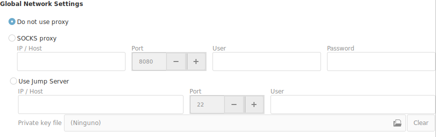

# Networking Options

If you are behind a firewall and have no direct access to the external network, you may need an intermediate machine to get outside of your network.

There are 2 technologies that can help you connect to a machine outside your network.

## SOCKS Proxy

If your network administrator has added a SOCKS server to the network and grants you access to it, you will have to select and configure the SOCKS Proxy.

+ __IP/Host__ : Address of your SOCKS Server
+ __User / Password__ : Should be set if your administration assigns you one.

## Jump Server

If you have access to a local machine in your network, that has access to the outside. And you have ___SSH___ access to this machine. Then you can use this technique to access to an external machine.

You need to have a public key installed in your __Jump Server__  to be able to use it as an intermediate machine to access the external network.

It can be a default public key, or a personal private key that you were assigned.

!!! note "Note about Keys"
    At the moment, the keys have to be "passwordless", without password.

+ __IP/Host__ : Address of your Jump Server
+ __Port__ : Port to use to connect.
+ __User__ : User to log in
+ __Private Key__
    - If you are assigned a private key, select the private key.
    - If you leave it blank, that it will default to your public local key.

!!! danger "Important"
    When you activate any of this options, the default exit for all your connections will be using the selected technology.

    There are two possible scenarios for your situation.

    + __Most of your connections are local inside your network__ : In this case you should leave the "Do not use proxy" option as the default. And configure the proxy or jump server for at the connection level.
    + __Most of your connections are outside your network__ : In this case select the technology that best fits your network.

