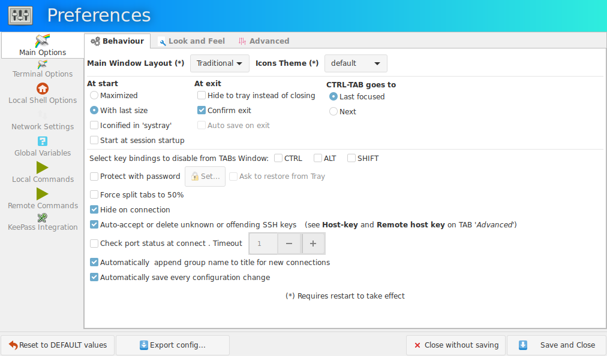
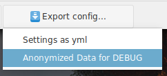
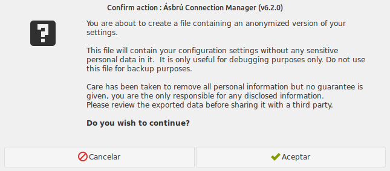

## Introduction

The first thing that you would like to customize is the application so it fits better to your way to work.

We'll begin by clicking in the "Preferences" button located at the bottom of the Standard Interface.

!!! note " "

    The first time you access the Preferences, will begin at : Main Options > Behaviour

    Subsequent access will open on the last Section > Tab you were editing previously.

The __Preferences__ window will be similar to the following image.

## Lower Buttons

+ __Reset to DEFAULT values__ : Will reset all configuration settings to there original state
+ __Export config__ : Export configuration settings (explained below).
+ __Close without saving__ : Abort any changes made and do not apply
+ __Save and Close__ : Will save all current settings and close the window.

!!! note "Restart Ásbru"
    Some options requiere to close and open Ásrbú, they will be marked with an asterix (*)

## Export Settings

To export your configurations click on the button : "Export config ..."

This options offers 2 export options

### Settings as yml

Will let you create a copy of all your configurations, so it can be backed up or used in another computer.

To use, copy the file to your config directory, located by default at: `/home/user/.config/asbru`

### Anonymized data for DEBUG

This creates a configuration file that cleans up all the sensitive information. Is requested and used by the Ásbrú Team to facilitate the solution of some bug report when we have problems trying to reproduce. Some bugs are related to the combination of settings and only can be reproduced all settings are known.

When you select this option you will receive a warning similar to the next image, and the option to cancel the process.

!!! warning "Review the file"
    The generated file can be reviewed with any text editor, just open the file and search or scroll the file to detect for any personal sensitive data that has remained and remove it.

    __If you detect that some data was no properly anonymized, please open an issue at__: [asbru-cm/issues](https://github.com/asbru-cm/asbru-cm/issues)

    Include in your report:
    
    + The line that was not anonymized (removing the sensitive data).
    + An image of the configuration window where this data belongs.
