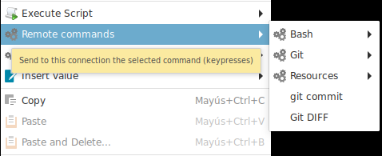
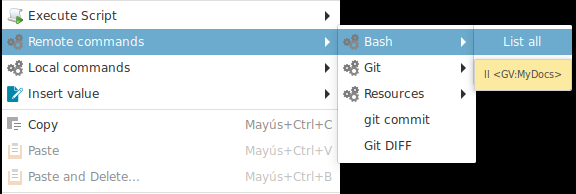
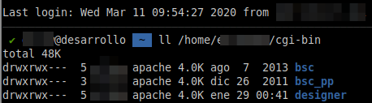

# Remote Commands

Remote commands are similar to local commands, but they will be executed on the remote connection.

To add a new remote command to the list, click on the "Add" Button.

## Fields

+ __Confirm__ : If Ásbrú should launch a confirmation dialog before executing the command. This is useful if your command has instructions that could remove data.
+ __Command__ : The command to be executed. It can contain global variables in it.
+ __Send `<INTRO>` at the end__ : Will send or not a \n at the end of the command string. Uncheck if you command requires you to type some extra information before sending the `<Enter>` key.
+ __Description__ : The name that will be displayed in the pop up menu.
    - Description has a pattern that you can use to group common commands. The patterns is : `Group:Name`
    - Descriptions with "no" group. Will be shown in after all grouped commands
    - If you omit giving a Description to your command, the command will become the description.
    - All commands are listed sorted alphabetically by Description.

## Execution

Example of the list generated of commands when you right click on the terminal and hover over the "Remote Commands" entry.

You will see all Bash commands grouped under the "Bash" group, followed by the "Git Commands" group, that were grouped and at the end you will see the list of all the commands that had no group.

If we select and execute the "List all" command, that has a global variable assigned in it, the command will be executed in the terminal (on the remote server), as shown in the next 2 images.

