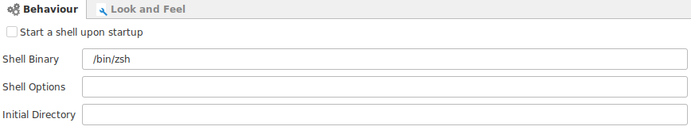
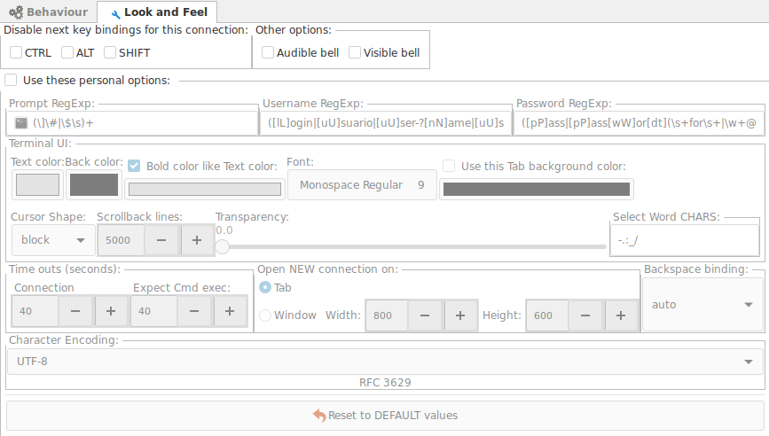

## Behaviour

+ __Start a shell on start up__ : Will open a local shell terminal when Ásbrú starts.
+ __Shell Binary__ : Path to your preferred shell (bash, zsh, fish).
+ __Shell options__ : any additional options to start your shell.
+ __Initial Directory__ : Path to your initial directory.

!!! warning "Initial Directory"
    The given path will not be expanded.  Consequently, a tilde (~) or `$HOME` will not be replaced by the home directory and shall not be used.

## Look & Feel

This Section holds terminal configurations specific for local shell terminals.

Activating this option will overwrite the Global Options.
