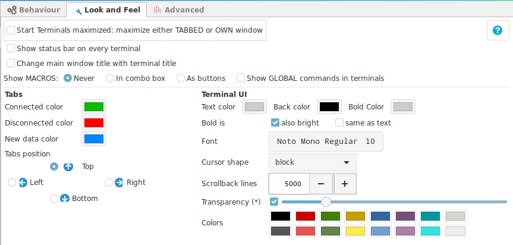

# Look & Feel

!!! note "Global Settings"
    This options apply to all terminals. If you need a particular terminal to behave differently is best to configure the look and feel options at the connection level.

+ __Start terminal maximized__ : If the new launched terminal window or tabbed window should be maximized.
+ __Show status bar on every terminal__ : Add extra information and buttons at the bottom of the termina.
+ __Change main window title with terminal title__ : Sets the main window (tabs window) title with the title from the selected terminal tab.

!!! tip "Password Managers"
    Changing the main window title with the current selected Tab, is useful with some password applications (like KeePassXC), that uses the main title window to execute auto typing sequences.

Example of a terminal windows with a status bar.

Example of terminal window without the status bar.

+ __Show MACROS__: Show access to local macros configured in a terminal
    - __Never__ : Do not show configured macros.
    - __In combobox__ : Show as a selection box, recommended when you have a long list.
    - __As buttons__ : Recommended when you have a very short list of macros.
    - __Show GLOBAL commands in terminal__ : Add the local and global commands to the list of available macros.

Example macros as buttons

Example macros as list

+ __Tabs__ : Define colors for tabs depending on their terminal current state. Set the position to locate the tabs.

+ __Terminal UI__
    - __Text color__ : Default color for text.
    - __Back color__ : Default background color for terminal.
    - __Bold color__ : Default bold color
+ __Bold is__
    - __Also bright__ : show bold text as bright text too. (Not available in all vterm versions)
    - __Same as text__ : show bold text as normal default text, no distinction
+ __Font__ : Set the font and size for all terminals.
+ __Cursor shape__ : Cursor shape to use in the terminal.
+ __Scrollback lines__ : How many lines of history to store to scroll back.
+ __Transparency__ : Set background transparency for the terminal.
    - You must enable transparency first to activate the transparency feature.
+ __Colors__ : Set your predefined colors to override the basic 16 terminal colors.
    - Top row are the normal text colors.
    - Bottom row are the bold text colors.

!!! danger "Transparency"
    Transparency __is not a feature__ , the transparency feature was removed from the Vte library.

    And to provide the so desired __visual effect__, a __hack__ into the code had to be applied to make it work.

    The conclusion is that it will consume more CPU resources. The reason is that the full window is made transparent, and the the visible areas that have to be visible, repainted.

    Depending on your environment, the impact could be minimal or high.

    There are too many things in an environment to list, but this are some of them:
    
    + screen resolution (the higher the resolution, more pixels to repaint)
    + desktop environment performance : gnome-shell, gnome-classic, cinnamon, xfce, etc.
    + Additional visual effects used in Ásbrú: show tooltips.
    + Number of CPUs, amount of ram, graphics card, etc.

    For a discussion about this you can check this thread: [Discussion about CPU usage](https://github.com/asbru-cm/asbru-cm/issues/533#issuecomment-607359378)