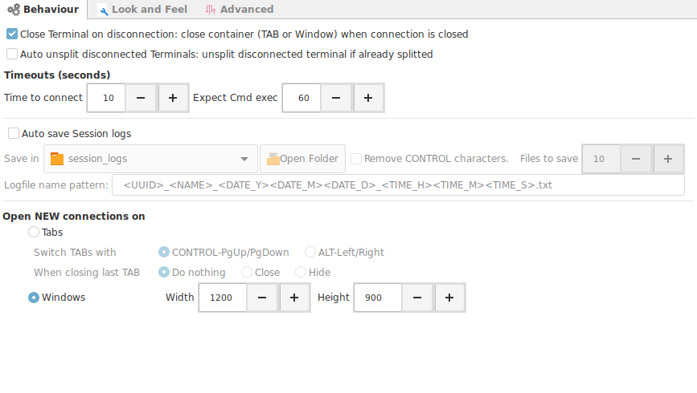

## Options

!!! note "Global Settings"
    This options apply to all terminals. If you need a particular terminal to behave differently is best to configure the look and feel options at the connection level.

+ __Close terminal on disconnect__
    - Enabled. The terminal will close immediately after : you type exit, a network error, disconnection from the server.
    - Disabled. You will be asked if you really want to close the terminal.
+ __Auto unsplit disconnected terminals__ : Same concept as previous option but with slit terminal.
+ __Timeouts__
    - __Time to connect__ : How many seconds to wait to establish new connection.
    - __Expect CMD exec__ : Time to wait for an expect sequence to execute.

+ __Auto save Session logs__ : When __enabled__, will save a log the complete session in a file for __all__ established connections.
    - __Save in__ : Location to save logs
    - __Remove control characters__ : Will clean the logs from all terminal control characters. Just leave a clean text output.
    - __Pattern for the filename__
+ __Open new connections on__
    - __Tabs__
        - Set the key combination to switch tabs.
        - Set the action to perform when closing the last tab.
    - __Windows__
        - Set predefined Width and Height.

