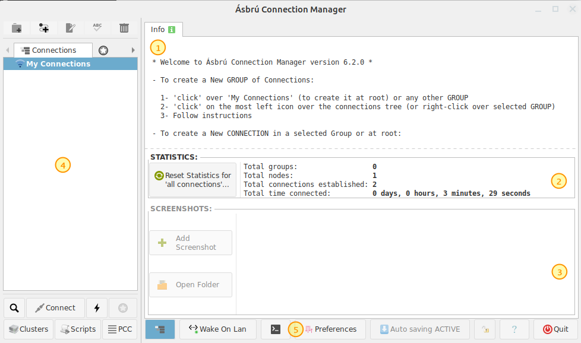
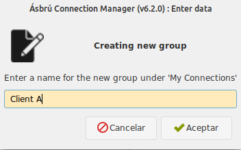
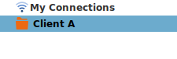
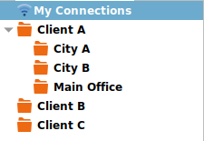
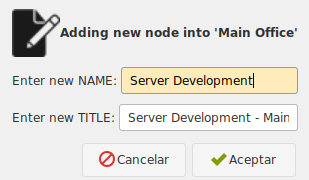
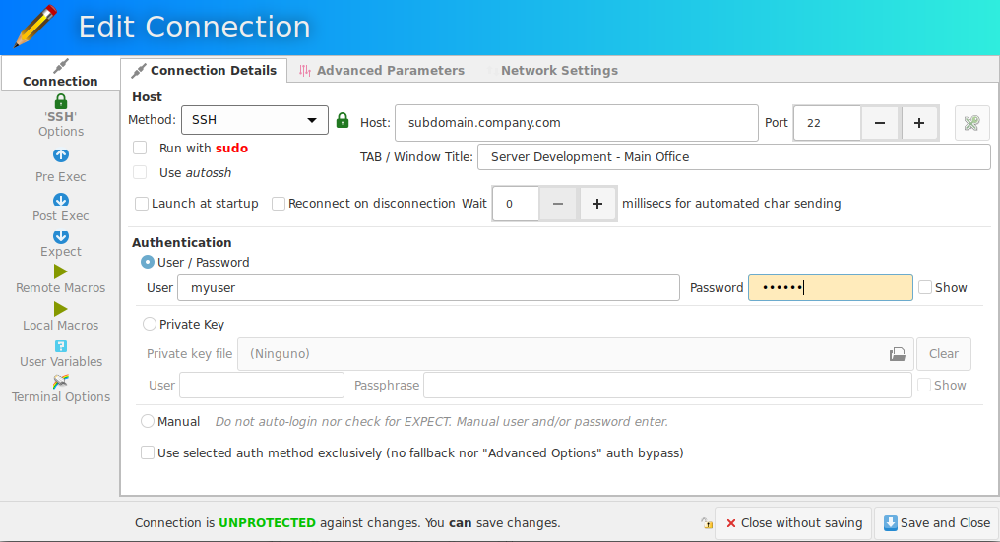
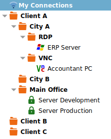

## Standard Interface

When you start Ásbrú for the first time, you'll see a standard interface similar to the next image.

+ __(1) Info tab__
    - On start it gives general instructions on how to create your first connection.
    - When you select/open a connection will allow you to type and save notes.
+ __(2) Statistics__
    - This section shows some statistics about your usage
+ __(3) Screenshots__
    - This section shows thumbnails of your currently saved screenshots
+ __(4) Your existing connections__
    - __Top toolbar__ : from left to right
        - Create a new group
        - Create a new connection configuration
        - Edit an existing connection
        - Rename a node in the connections list (you can rename groups or connections)
        - Delete a current node (group / connection)
    - __Connections__
        - This tab shows all your currently configured connections
            - Double click on an existing connection to launch the session
            - Double clic on a group to expand/contract its children
        -Select and node and right click to show a popup menu with available options for the current node
    - __Favourites__
        - List of connections that you have marked as favourite connections
    - __History__
        - List of must recent opened session
    - __Clusters__
        - Listo of current configured clusters (clusters are groups of connections that will open simultaneously and will share keystrokes and mouse events)
+ __(5) Preferences__
    - Access to the configuration settings that allows you to customize the behavior, appearance and tune some actions to your particular needs.

## Connection list management

- Click on _My Connections_ to create a new group or connection at root level.
- Clic on a current existing group to create a new group or connection at group level
- Select a node
    - click on any of the top toolbar buttons (add, delete, rename, edit)
    - right click and select desireg action (add, delete, rename, edit)

!!! note "Recommended"
    Always create groups at root level.  
    This will allow you to organize your connections in some meaningful order.

    Example of a __Client__ driven configuration tree:

    + __Client Name__
        + __Main Office__
            + __VNC__
                - vnc PC1
                - vnc Shipment Scale
            + __RDP__
                - rdp PC2
            - ssh Server
            - ssh SQL Server
        + __Plant on City A__
            - ssh Server
            - ssh RaspBerryPi
            - ssh Shipment scale
        + __Plant on City B__
            - ssh Server
            - ssh Backups
    + __Client B__
        - ssh Server A
        - ssh Server B
    + __Client C__
        - ssh Server A
        - ssh Server B

    __Choose the logic that best fits you__, some possible organization trees

    + Connection Type (ssh,vnc,rdp) > Client (client names) > Locations (locations if exist)
    + Client > Service Type (ssh, sqlserver, etc)
    + Project Name > Client Name > Services

## Create a group

1. Click on an existing group or _My Connections_ (root level).
1. Click on `add group` button or right click on selected group
1. Add a name to your group
1. Click "Accept"

__Connection list__ after

Add more groups

## Create Connections

We will show the basic procedure to configure a basic ssh connection, there is a dedicated section for each type of connection with full details on how to configure more complex one.

1. Click on a group where you want to add your current ssh connection
1. Click on the Add connection icon. Or right click on the group and select "Add connection"

__Give your connection a name that will hint you where will you be connecting__

__Configure your connection__

Click on "Save and Close" button

__Example of a connections tree after several connections have been added__

## Editing the connection list

### To move a connection or full group from one place in the tree to another.

1. Select a connection or full group
1. `<Ctrl-X>` to cut the node (or right click Cut)
1. `<Ctrl-V>` to paste the node in the new location

### To copy an existing connection so you can replace some parameters

1. Select a connection
1. `<Ctrl-C>` to copy the node (or right click Copy)
1. `<Ctrl-V>` to paste the node in the new location

### To clone an existing connection

1. Select a connection
1. `<Ctrl-D>` to duplicate connection (or right click Clone Connection)

!!! danger "Important notes"
    gnome-shell requires that a tray extension be installed to be able to show the icon on the tray.

    If you do not install the extension, and activate "hide to tray on close", your will have no access to the main window anymore.

    Ásrbú knows about some of this extensions and will try to detect them. If they are not available, the close to tray icon option, will minimize the Window instead of hide it.
    
    Check [System Tray Extensions for some recommendations](Preferences/SytemTrayExtensions.md)