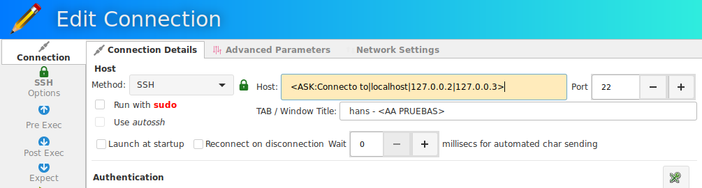
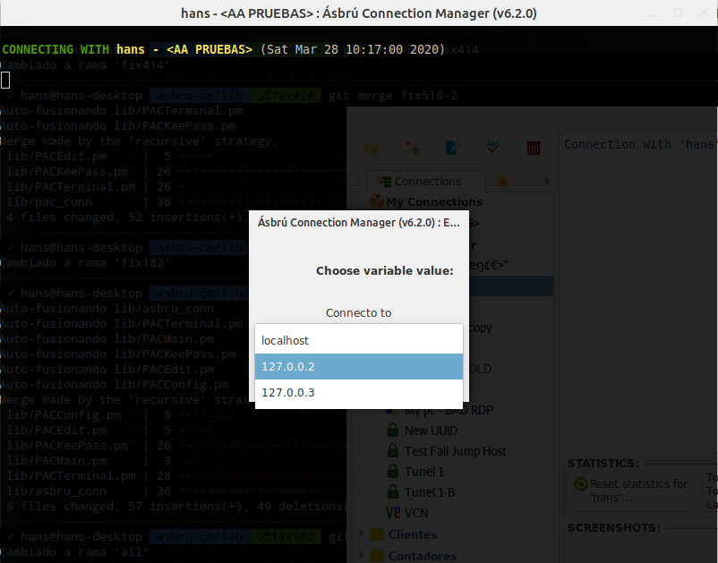

# Substitutions

Inside many fields, values can be represented as masks. And this masks will be substituted by their real value at the time of a connection.

These masks can be included in fields like : Global variables, local or remote commands, expects, some connection parameters.

The general format of the mask is `<[(Name|Type):]VALUE>`

## Internal Variables

`<name>`

|Name              |Description                        |
|------------------|-----------------------------------|
|IP                |Connection IP or Host              |
|PORT              |Connection PORT                    |
|USER              |Connection USER                    |
|PASS              |Connection Password                |
|UUID              |Connection UUID                    |
|TIMESTAMP         |Elapsed time in seconds since epoch|
|DATE_Y            |Year                               |
|DATE_M            |Month                              |
|DATE_D            |Day                                |
|TIME_H            |Hour                               |
|TIME_M            |Minute                             |
|TIME_S            |Seconds                            |
|NAME              |Connection Name                    |
|TITLE             |Connection Title                   |
|command prompt    |Configured command prompt regex    |

## Environment Variables

`<ENV:name>`

Examples

|Name    |Value      |
|--------|-----------|
|LANG    |es_MX.UTF-8|
|DISPLAY |:0         |
|HOME    |/home/user |

## Global Variables

These are created in you General Preferences > Global Variables

`<GV:variable name>`

## ASK

Will prompt user to enter data and use that data for substitution

`<ASK:parameters>`

|Parameters                      |Action                               |
|--------------------------------|-------------------------------------|
|`description|opt1|opt2|opt3|..` |select box with options (opt1,..)    |
|description|value               |textbox with predefined value        |
|description                     |textbox empty                        |

__Example:__

Lets say that you want to use a connection configuration with 2 different servers, but you do not want to have 2 separate configurations for this.

The only thing that changes is the IP

Create an ASK Mask in your Host entry like this : `<ASK:Select host|destination1.com|destination2.com|...>`

When you connect the terminal will prompt you to select an IP from the previous list that you created.

## CMD

Will execute a command with the shell and use the output of that command for substitution

Example

`<CMD:date>`

Will execute date in the shell, and the resulting date will be used for the substitution.

## KeePass

If you need to type a mask in a field where the right click access is not available or you want to pull a value different than the predefined user or password.

`<field|path to key>`

Example

`<title|/banks/tdc/0000>`

For a full reference on how to use [KeePass Integration ](Preferences/KeePassXC.md)

